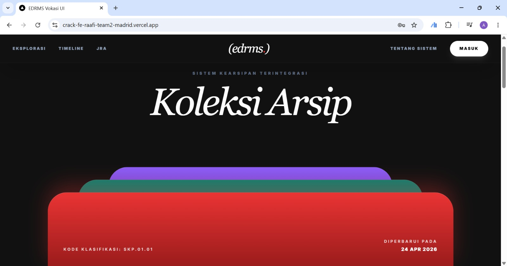
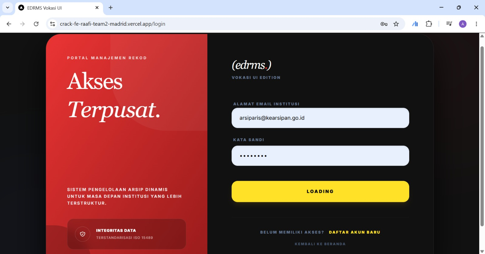
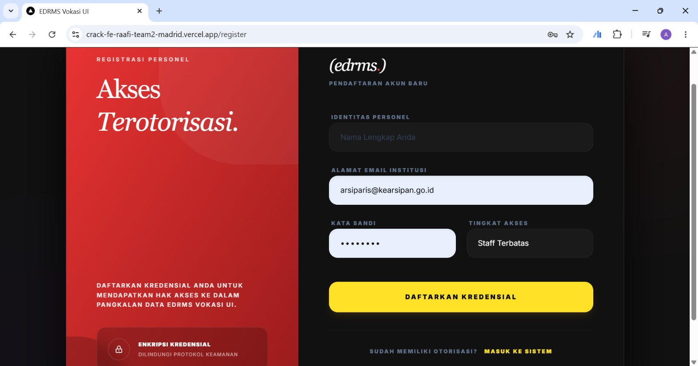
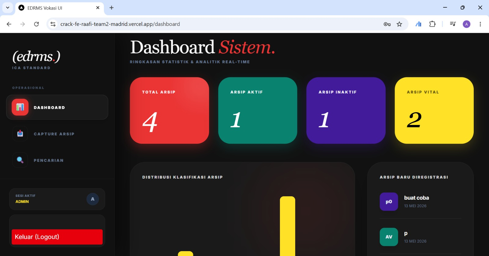

# 🖥️ Frontend EDRMS Vokasi UI Enterprise
### (Sistem Pengelolaan Arsip Dinamis Berbasis Web)

Repositori ini berisi antarmuka pengguna (User Interface) sisi klien untuk aplikasi **EDRMS**. Antarmuka ini dirancang untuk memudahkan arsiparis dan staf dalam melakukan *capturing* arsip, pencarian, dan pemantauan statistik pangkalan data secara *real-time*.

---

## 🔗 Tautan Live Demo
Sistem ini telah di-deploy menggunakan Vercel dan dapat diakses secara publik melalui tautan berikut:
👉 **[Buka Aplikasi EDRMS (Live)](https://crack-fe-raafi-team2-madrid.vercel.app)**

---

## 🛠️ Teknologi yang Digunakan
Antarmuka ini dibangun menggunakan *tech stack* modern untuk memastikan performa yang cepat dan responsif:
- **Framework:** Next.js (React)
- **Styling:** Tailwind CSS
- **State Management:** React Hooks
- **HTTP Client:** Fetch API / Axios (terintegrasi dengan Backend NestJS)
- **Deployment:** Vercel

---

## 📸 Tampilan Sistem (Screenshots)

Berikut adalah beberapa pratinjau dari antarmuka sistem EDRMS:

### 1. Halaman Eksplorasi (Landing Page)
Menampilkan visualisasi koleksi arsip yang elegan sebelum pengguna masuk ke dalam pangkalan data.


### 2. Portal Akses Terpusat (Login & Register)
Dilengkapi dengan perlindungan *Route Guarding* dan otentikasi JWT untuk menjamin keamanan akses personel.
| Halaman Login | Halaman Register |
| :---: | :---: |
|  |  |

### 3. Dashboard Analitik Real-Time
Pusat kendali arsiparis untuk memantau total arsip, distribusi klasifikasi, dan status retensi arsip secara langsung.


---

## 🚀 Panduan Instalasi Lokal

Jika ingin menjalankan antarmuka ini di komputer lokal, ikuti langkah berikut:

1. **Clone Repositori:**
   ```bash
   git clone [https://github.com/RaafiTeam2Madrid/crack-fe-RaafiTeam2Madrid.git](https://github.com/RaafiTeam2Madrid/crack-fe-RaafiTeam2Madrid.git)
   cd crack-fe-RaafiTeam2Madrid